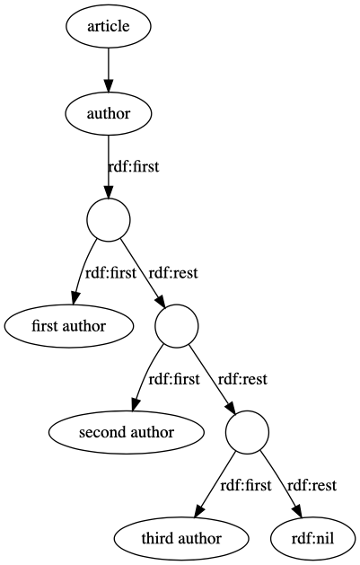

# JSON-LD in the wild

Real world JSON-LD examples we can use for inspiration. Some of these examples may no longer be available, or have changed. The JSON displayed here may be truncated to keep the page readable, click on the link to get the complete JSON document. Note that some of the JSON-LD is not valid RDF, much of it has probably never been used by RDF clients such as triple stores.

I’ve highlight some interesting features, such as use of the `@reverse` keyword, and ordering items in a list.

## Catalogue of Life

Based on TaxonName DRAFT Profile [0.1-DRAFT](https://bioschemas.org/profiles/TaxonName/0.1-DRAFT/) and [0.6-RELEASE](https://bioschemas.org/profiles/Taxon/0.6-RELEASE/).

Embedded in HTML using `<script type="application/ld+json"></script>` tags, e.g. https://www.catalogueoflife.org/data/taxon/5TVFG

:x: No `@id` for the taxon, so the JSON-LD below is not explicitly connected to https://www.catalogueoflife.org/data/taxon/5TVFG

[col.json](col.json)

```json
{
  "@context": [
    "https://schema.org/",
    {
      "dwc": "http://rs.tdwg.org/dwc/terms/",
      "col": "http://catalogueoflife.org/terms/"
    }
  ],
  "@type": "Taxon",
  "additionalType": [
    "dwc:Taxon",
    "http://rs.tdwg.org/ontology/voc/TaxonConcept#TaxonConcept"
  ],
  "identifier": [{
      "@type": "PropertyValue",
      "name": "dwc:taxonID",
      "propertyID": "http://rs.tdwg.org/dwc/terms/taxonID",
      "value": "5TVFG"
    },
    {
      "@type": "PropertyValue",
      "name": "col:ID",
      "propertyID": "http://catalogueoflife.org/terms/ID",
      "value": "5TVFG"
    }
  ],
  "name": "Allacta deleportei Roth, L. M., 1995",
  "scientificName": {
    "@type": "TaxonName",
    "name": "Allacta deleportei",
    "author": "Roth, L. M., 1995",
    "taxonRank": "Species",
    "isBasedOn": {
      "@type": "ScholarlyArticle",
      "name": "Roth, L. M. New species of Allacta Saussure and Zehntner from Papua New Guinea, Irian Jaya, and Sarawak (Blattaria, Blattellidae: Pseudophyllodromiinae). Papua New Guinea J. Agric. 38:51-71. (1995)."
    }
  },
  "taxonRank": [
    "http://api.catalogueoflife.org/vocab/rank/Species",
    "Species"
  ],
  "parentTaxon": {
    "@type": "Taxon",
    "name": "Allacta",
    "scientificName": {
      "@type": "TaxonName",
      "name": "Allacta",
      "author": "",
      "taxonRank": "Genus"
    },
    "identifier": [{
        "@type": "PropertyValue",
        "name": "dwc:taxonID",
        "propertyID": "http://rs.tdwg.org/dwc/terms/taxonID",
        "value": "RZX"
      },
      {
        "@type": "PropertyValue",
        "name": "col:ID",
        "propertyID": "http://catalogueoflife.org/terms/ID",
        "value": "RZX"
      }
    ],
    "taxonRank": [
      "http://rs.gbif.org/vocabulary/gbif/rank/Genus",
      "Genus"
    ]
  }
}
```

## Encyclopedia of Life (EOL)

An earlier version of EOL supported JSON-LD via their API (trait bank). They had JSON-LD for taxa, and for “collections” (user-created lists of species).

:x: This JSON-LD is not valid, see https://github.com/EOL/deprecated_eol/issues/139

[116394-unsorted.json](116394-unsorted.json)

```json
{
  "name": "Birds, Sangster and Luksenburg",
  "description": "Bird species described over period 1935-2009. This list comes from the dataset http://dx.doi.org/10.5061/dryad.m4g2n, associated with paper http://dx.doi.org/10.1093/sysbio/syu069",
  "logo_url": "http://160.111.248.28/content/2015/04/25/21/54822_130_130.jpg",
  "created": "2015-04-21T21:14:05Z",
  "modified": "2015-04-26T01:36:19Z",
  "total_items": 386,
  "item_types": [{
    "item_type": "TaxonConcept",
    "item_count": 386
  }, {
    "item_type": "Text",
    "item_count": 0
  }, {
    "item_type": "Video",
    "item_count": 0
  }, {
    "item_type": "Image",
    "item_count": 0
  }, {
    "item_type": "Sound",
    "item_count": 0
  }, {
    "item_type": "Community",
    "item_count": 0
  }, {
    "item_type": "User",
    "item_count": 0
  }, {
    "item_type": "Collection",
    "item_count": 0
  }],
  "collection_items": [{
        "name": "Synallaxis beverlyae",
        "object_type": "TaxonConcept",
        "object_id": 10692652,
        "title": null,
        "created": "2015-04-22T17:22:06Z",
        "updated": "2015-04-22T17:22:06Z",
        "annotation": null,
        "sort_field": null,
        "references": [],
        "richness_score": 31.0803
      }, {
        "name": "Scepomycter rubehoensis Bowie, Fjeldsa & Kiure, 2009",
        "object_type": "TaxonConcept",
        "object_id": 10692649,
        "title": null,
        "created": "2015-04-22T17:21:52Z",
        "updated": "2015-04-22T17:21:52Z",
        "annotation": null,
        "sort_field": null,
        "references": [],
        "richness_score": 13.6252
      }
…
]
}
```

[10692652-taxon-traits.json](10692652-taxon-traits.json)

```json
{
  "@context": {
    "@vocab": "http://schema.org/",
    "dwc:taxonID": {
      "@type": "@id"
    },
    "dwc:resourceID": {
      "@type": "@id"
    },
    "dwc:relatedResourceID": {
      "@type": "@id"
    },
    "dwc:relationshipOfResource": {
      "@type": "@id"
    },
    "dwc:vernacularName": {
      "@container": "@language"
    },
    "eol:associationType": {
      "@type": "@id"
    },
    "rdfs:label": {
      "@container": "@language"
    },
    "dc": "http://purl.org/dc/terms/",
    "dwc": "http://rs.tdwg.org/dwc/terms/",
    "eolterms": "http://eol.org/schema/terms/",
    "eol": "http://eol.org/schema/",
    "rdfs": "http://www.w3.org/2000/01/rdf-schema#",
    "gbif": "http://rs.gbif.org/terms/1.0/",
    "foaf": "http://xmlns.com/foaf/0.1/"
  },
  "@type": "DataFeedItem",
  "dateModified": "2016-09-11",
  "item": {
    "@id": 10692652,
    "@type": "dwc:Taxon",
    "scientificName": "Synallaxis beverlyae",
    "dwc:taxonRank": "species",
    "dwc:parentNameUsageID": "http://eol.org/pages/15003",
    "potentialAction": {
      "@type": "EntryPoint",
      "target": {
        "@type": "Related",
        "url": "http://eol.org/pages/10692652",
        "actionPlatform": [
          "http://schema.org/DesktopWebPlatform",
          "http://schema.org/IOSPlatform",
          "http://schema.org/AndroidPlatform"
        ]
      }
    },
    "sameAs": [
      "http://www.birdlife.org/datazone/speciesfactsheet.php?id=32678",
      "http://lod.taxonconcept.org/ses/voUQo.html",
      "http://www.iucnredlist.org/apps/redlist/details/22736309",
      "http://www.iucnredlist.org/apps/redlist/details/22736309",
      "http://en.wikipedia.org/w/index.php?title=Río_Orinoco_Spinetail"
    ],
    "vernacularNames": [{
      "@language": "en",
      "@value": "Rio Orinoco Spinetail",
      "gbif:isPreferredName": true
    }],
    "traits": [{
        "@id": "http://eol.org/pages/10692652/data#data_point_38830289",
        "eol:traitUri": "http://eol.org/resources/737/measurements/a2d4b468c0c1724d9909c352ba147e28",
        "@type": "dwc:MeasurementOrFact",
        "predicate": "population trend",
        "dwc:measurementType": "http://iucn.org/population_trend",
        "value": "Stable",
        "eol:dataPointId": 38830289,
        "dc:source": "http://eol.org/resources/737",
        "dwc:measurementValue": "Stable",
        "dwc:scientificName": "Synallaxis beverlyae Hilty and Ascanio, 2009"
      },
      {
        "@id": "http://eol.org/pages/10692652/data#data_point_38830288",
        "eol:traitUri": "http://eol.org/resources/737/measurements/df109fa354806cc41182a5ae52c6c96e",
        "@type": "dwc:MeasurementOrFact",
        "predicate": "habitat",
        "dwc:measurementType": "http://rs.tdwg.org/dwc/terms/habitat",
        "value": "freshwater habitat",
        "eol:dataPointId": 38830288,
        "dc:source": "http://eol.org/resources/737",
        "dwc:measurementValue": "http://purl.obolibrary.org/obo/ENVO_00002037",
        "dwc:scientificName": "Synallaxis beverlyae Hilty and Ascanio, 2009"
      },
      {
        "@id": "http://eol.org/pages/10692652/data#data_point_38830287",
        "eol:traitUri": "http://eol.org/resources/737/measurements/4d8a9afd7921c5dceee23a5775690dc1",
        "@type": "dwc:MeasurementOrFact",
        "predicate": "habitat",
        "dwc:measurementType": "http://rs.tdwg.org/dwc/terms/habitat",
        "value": "terrestrial habitat",
        "eol:dataPointId": 38830287,
        "dc:source": "http://eol.org/resources/737",
        "dwc:measurementValue": "http://purl.obolibrary.org/obo/ENVO_00002009",
        "dwc:scientificName": "Synallaxis beverlyae Hilty and Ascanio, 2009"
      },
…
    ]
  }
}
```

## ORCID

ORCID supports JSON-LD via content negotiation, e.g.

```curl -L -H 'Accept: application/ld+json' https://orcid.org/0000-0002-2168-0514```

:warning: Note the use of `@reverse` to associate person with publications. There is no notion of order of authorship, and any other authors are not listed (even if they have ORCID’s).

[orcid](orcid.json)

```json
{
  "@context": "http://schema.org",
  "@type": "Person",
  "@id": "https://orcid.org/0000-0002-2168-0514",
  "mainEntityOfPage": "https://orcid.org/0000-0002-2168-0514",
  "givenName": "Mark",
  "familyName": "Hughes",
  "affiliation": {
    "@type": "Organization",
    "name": "Royal Botanic Garden Edinburgh",
    "identifier": {
      "@type": "PropertyValue",
      "propertyID": "RINGGOLD",
      "value": "41803"
    }
  },
  "@reverse": {
    "creator": [{
        "@type": "CreativeWork",
        "@id": "https://doi.org/10.1017/s0960428619000283",
        "name": "BEGONIA MAGUNIANA (BEGONIACEAE, BEGONIA SECT. OLIGANDRAE), A NEW SPECIES FROM NEW GUINEA",
        "identifier": {
          "@type": "PropertyValue",
          "propertyID": "doi",
          "value": "10.1017/s0960428619000283"
        }
      },
     …

    ]
  },
  "url": [
    "https://www.rbge.org.uk/about-us/organisational-structure/staff/tropical-diversity/dr-mark-hughes/",
    "https://www.mendeley.com/profiles/mark-hughes/"
  ],
  "identifier": [{
      "@type": "PropertyValue",
      "propertyID": "Loop profile",
      "value": "845425"
    },
    {
      "@type": "PropertyValue",
      "propertyID": "Loop profile",
      "value": "826408"
    }
  ]
}
```

## Oxford University Press (OUP)

OUP embeds JSON-LD in their web pages, e.g. https://academic.oup.com/botlinnean/article/183/3/373/3092408

:warning: Note the horrible image URLs that include timestamps and other ephemeral parameters.
::warning: Note the nested `schema:isPartOf` relationships to model a `ScholarlyArticle` within a `PublicationIssue` within a `Periodical`.

[oup.json](oup.json)

```json
{
  "@context": "https://schema.org",
  "@type": "ScholarlyArticle",
  "@id": "https://academic.oup.com/botlinnean/article/183/3/373/3092408",
  "name": "Systematics of Libinhania, a new endemic genus of Gnaphalieae (Asteraceae) from the Socotra archipelago (Yemen), inferred from plastid, low-copy nuclear and nuclear ribosomal DNA loci",
  "datePublished": "2017-03-29",
  "isPartOf": {
    "@id": "https://academic.oup.com/botlinnean/botlinnean/issue/183/3",
    "@type": "PublicationIssue",
    "issueNumber": "3",
    "datePublished": "2017-03-01",
    "isPartOf": {
      "@id": "https://academic.oup.com/botlinnean/botlinnean",
      "@type": "Periodical",
      "name": "Botanical Journal of the Linnean Society",
      "issn": ["1095-8339"]
    }
  },
  "url": "https://dx.doi.org/10.1093/botlinnean/bow013",
  "keywords": ["allopolyploidy", "ancestral state reconstruction", "Compositae", "Helichrysum", "morphology", "phylogenetics", "reticulate evolution", "taxonomy"],
  "inLanguage": "en",
  "copyrightHolder": "The Linnean Society of London",
  "copyrightYear": "2021",
  "publisher": "Oxford University Press",
  "sameAs": "https://academic.oup.com/botlinnean/article/183/3/373/3092408",
  "author": [{
    "name": "Kilian, Norbert",
    "affiliation": "1  Botanic Garden and Botanical Museum Berlin, Freie Universität Berlin ,  Königin-Luise-Str. 6–8, 14195 Berlin ,  Germany",
    "@type": "Person"
  }, {
    "name": "Galbany-Casals, Mercè",
    "affiliation": "2  Departament de Biologia Animal, Biologia Vegetal i Ecologia, Facultat de Biociències, Universitat Autònoma de Barcelona ,  08193 Bellaterra ,  Spain",
    "@type": "Person"
  }, {
    "name": "Sommerer, Ronny",
    "affiliation": "1  Botanic Garden and Botanical Museum Berlin, Freie Universität Berlin ,  Königin-Luise-Str. 6–8, 14195 Berlin ,  Germany",
    "@type": "Person"
  }, {
    "name": "Oberprieler, Christoph",
    "affiliation": "3  Evolutionary and Systematic Botany, Institute of Plant Sciences, University of Regensburg, Universitätsstr .  31, 93053 Regensburg ,  Germany",
    "@type": "Person"
  }, {
    "name": "Smissen, Rob",
    "affiliation": "4  Allan Herbarium, Landcare Research ,  P.O. Box 69040, Lincoln 7640 ,  New Zealand",
    "@type": "Person"
  }, {
    "name": "Miller, Antony",
    "affiliation": "5  Centre for Middle Eastern Plants, Royal Botanic Garden Edinburgh ,  20A Inverleith Row, Edinburgh EH3 5LR ,  UK",
    "@type": "Person"
  }, {
    "name": "Rabe, Katharina",
    "affiliation": "1  Botanic Garden and Botanical Museum Berlin, Freie Universität Berlin ,  Königin-Luise-Str. 6–8, 14195 Berlin ,  Germany",
    "@type": "Person"
  }],
  "description": "Abstract. The Socotra archipelago off the Horn of Africa shelters morphologically diverse endemic species of Asteraceae tribe Gnaphalieae, eight species placed ",
  "pageStart": "373",
  "pageEnd": "412",
  "thumbnailURL": "https://oup.silverchair-cdn.com/oup/backfile/Content_public/Journal/botlinnean/Issue/183/3/2/m_cover.jpeg?Expires=1693078539&Signature=yTEaF50jlovutk2hTbTPGXMMOXwNdLPjSu4~cVx4jgX1HJKM2mJbFnInOILp08pNsbCtM9d-dJliWX4oP94FcFYIOauK7Aa5soOcgU5eihKPFTvSIgGGYyIiz-IWPlvWyF6ZOQv4T884bGPujueT2pybcXHqBiEqLVFpF3SYbJxDbGnPyxGFsk23vhfmbdxup4Y5AV~meKeumSYFzNetiZeOXp1xLSYzFb3SeUWNlr~jpzl32xheIekDxtTueD1dBKdd2Lh69p8UUD2rm-g6UGaprmZsXuimn30ZFDXS5Duf6QoXUFfb0PLPEn5D4502L-7to5FOzsy4w7SUdIkr3Q__&Key-Pair-Id=APKAIE5G5CRDK6RD3PGA",
  "headline": "Systematics of Libinhania, a new endemic genus of Gnaphalieae (Asteraceae) from the Socotra archipelago (Yemen), inferred from plastid, low-copy nuclear and nuclear ribosomal DNA loci",
  "image": "https://oup.silverchair-cdn.com/oup/backfile/Content_public/Journal/botlinnean/Issue/183/3/2/m_cover.jpeg?Expires=1693078539&Signature=yTEaF50jlovutk2hTbTPGXMMOXwNdLPjSu4~cVx4jgX1HJKM2mJbFnInOILp08pNsbCtM9d-dJliWX4oP94FcFYIOauK7Aa5soOcgU5eihKPFTvSIgGGYyIiz-IWPlvWyF6ZOQv4T884bGPujueT2pybcXHqBiEqLVFpF3SYbJxDbGnPyxGFsk23vhfmbdxup4Y5AV~meKeumSYFzNetiZeOXp1xLSYzFb3SeUWNlr~jpzl32xheIekDxtTueD1dBKdd2Lh69p8UUD2rm-g6UGaprmZsXuimn30ZFDXS5Duf6QoXUFfb0PLPEn5D4502L-7to5FOzsy4w7SUdIkr3Q__&Key-Pair-Id=APKAIE5G5CRDK6RD3PGA"
}
```

## ResearchGate

At one point ResearchGate embedded [schema.org](http://schema.org) in their web pages, but they seemed to have stopped doing this(?).

:warning: Note the lack of `@id`, and using `schema:mainEntityOfPage` (with a relative URL) to link person and web page.

[researchgate.json](researchgate.json)

```json
{
  "@context": "http://schema.org/",
  "@type": "Person",
  "mainEntityOfPage": "scientific-contributions/2054435998_Mark_Hughes",
  "name": "Mark Hughes",
  "image": "https://c5.rgstatic.net/m/420791293341780/images/template/default/author/author_default_l.jpg",
  "url": "https://www.researchgate.net/scientific-contributions/2054435998_Mark_Hughes",
  "affiliation": {
    "@type": "Organization",
    "name": "Royal Botanic Garden Edinburgh",
    "url": "https://www.researchgate.net/institution/Royal_Botanic_Garden_Edinburgh"
  }
}
```

[researchgate-one-paper](researchgate-one-paper.json)

```json
{
    "@context": "https://schema.org/",
    "@type": "ScholarlyArticle",
    "datePublished": "2019-07-01",
    "headline": "Zingiber perenense, a new species in Zingiber section Cryptanthium (Zingiberaceae) from Nagaland, India",
    "mainEntityOfPage": "https://www.researchgate.net/publication/334171947_Zingiber_perenense_a_new_species_in_Zingiber_section_Cryptanthium_Zingiberaceae_from_Nagaland_India",
    "author": [{
      "@context": "https://schema.org/",
      "@type": "Person",
      "name": "Nripemo Odyuo",
      "url": "https://www.researchgate.net/profile/Nripemo_Odyuo",
      "image": "https://i1.rgstatic.net/ii/profile.image/657589205495810-1533792892690_Q64/Nripemo_Odyuo.jpg",
      "memberOf": {
        "@context": "https://schema.org/",
        "@type": "Organization",
        "name": "Botanical Survey fo India"
      }
    }, {
      "@context": "https://schema.org/",
      "@type": "Person",
      "name": "Dilip Kr. Roy",
      "url": "https://www.researchgate.net/profile/Dilip_Kr_Roy",
      "image": "https://i1.rgstatic.net/ii/profile.image/303916372168705-1449470717804_Q64/Dilip_Kr_Roy.jpg",
      "memberOf": {
        "@context": "https://schema.org/",
        "@type": "Organization",
        "name": "Botanical Survey of India, Shillong"
      }
    }, {
      "@context": "https://schema.org/",
      "@type": "Person",
      "name": "Chalbasson Lyngwa",
      "url": "https://www.researchgate.net/scientific-contributions/2159356546_Chalbasson_Lyngwa",
      "image": "https://c5.rgstatic.net/m/435982309481010/images/template/default/author/author_default_m.jpg"
    }, {
      "@context": "https://schema.org/",
      "@type": "Person",
      "name": "A. A. Mao",
      "url": "https://www.researchgate.net/profile/A_Mao",
      "image": "https://i1.rgstatic.net/ii/profile.image/526099911909377-1502443401216_Q64/A_Mao.jpg",
      "memberOf": {
        "@context": "https://schema.org/",
        "@type": "Organization",
        "name": "Botanical Survey of India, Shillong"
      }
    }]
}
```


## SciGraph

SciGraph uses JSON-LD as the canonical representation of their data. It can be retrieved by content-negotiation.

```curl -L http://scigraph.springernature.com/pub.10.1007/s00606-016-1316-4.json```


:warning: Unlike, say, OUP, SciGraph doesn’t nest `schema:isPartOf` relations when linking an article to the issue, volume, and periodical.

:warning: The SciGraph JSON-LD treats authors as an ordered list, which you can see from their context:

```json
        "author": {
            "@id": "schema:author",
            "@container": "@list"
        },
```

RDF has no built-in notion of order, so this is achieved using `rdfs:lists`. See http://www.snee.com/bobdc.blog/2014/04/rdf-lists-and-sparql.html and https://stackoverflow.com/questions/17523804/is-it-possible-to-get-the-position-of-an-element-in-an-rdf-collection-in-sparql/17530689#17530689 for more discussion. If you look at the ntriples version of the SciGraph RDF (e.g., [s00606-016-1316-4.nt](s00606-016-1316-4.nt)) you will see that the value for `schema:author` is a blank node (bnode), and that this bnode has two predicates, `rdf:first` and `rdf:rest`. One points to an author, the other points to another bnode. This pattern repeats until we encounter a value of `rdf:nil` for `rdf:rest`.



So to store an ordered list of authors we create a [singly-linked list[(https://en.wikipedia.org/wiki/Linked_list#Singly_linked_list) in RDF.

[s00606-016-1316-4.json](s00606-016-1316-4.json)

```json
{
    "about": [
        {
            "id": "http://purl.org/au-research/vocabulary/anzsrc-for/2008/0604", 
            "inDefinedTermSet": "http://purl.org/au-research/vocabulary/anzsrc-for/2008/", 
            "name": "Genetics", 
            "type": "DefinedTerm"
        }, 
        {
            "id": "http://purl.org/au-research/vocabulary/anzsrc-for/2008/06", 
            "inDefinedTermSet": "http://purl.org/au-research/vocabulary/anzsrc-for/2008/", 
            "name": "Biological Sciences", 
            "type": "DefinedTerm"
        }
    ], 
    "author": [
        {
            "affiliation": {
                "name": [
                    "Instituto de Bot\u00e1nica Darwinion-CONICET, Labard\u00e9n 200, CC 22, B1642HYD, San Isidro, Buenos Aires, Argentina"
                ], 
                "type": "Organization"
            }, 
            "familyName": "Urtubey", 
            "givenName": "Estrella", 
            "id": "sg:person.013337044763.79", 
            "sameAs": [
                "https://app.dimensions.ai/discover/publication?and_facet_researcher=ur.013337044763.79"
            ], 
            "type": "Person"
        }, 
        {
            "affiliation": {
                "name": [
                    "Instituto de Bot\u00e1nica Darwinion-CONICET, Labard\u00e9n 200, CC 22, B1642HYD, San Isidro, Buenos Aires, Argentina"
                ], 
                "type": "Organization"
            }, 
            "familyName": "L\u00f3pez", 
            "givenName": "Alicia", 
            "id": "sg:person.013135326054.83", 
            "sameAs": [
                "https://app.dimensions.ai/discover/publication?and_facet_researcher=ur.013135326054.83"
            ], 
            "type": "Person"
        }
…
    ], 
    "citation": [
        {
            "id": "https://doi.org/10.1080/0028825x.1971.10430174", 
            "sameAs": [
                "https://app.dimensions.ai/details/publication/pub.1000414033"
            ], 
            "type": "CreativeWork"
        }, 
        {
            "id": "https://doi.org/10.1006/mpev.1998.0545", 
            "sameAs": [
                "https://app.dimensions.ai/details/publication/pub.1003208658"
            ], 
            "type": "CreativeWork"
        },
…
    ], 
    "datePublished": "2016-10", 
    "datePublishedReg": "2016-10-01", 
    "description": "Gamochaeta (tribe Gnaphalieae, Asteraceae) is composed of ca. 60 species primarily distributed in tropical and subtropical America. Within the tribe Gnaphalieae, the genus is characterized by capitula arranged in spikes or head-like clusters, few hermaphroditic central florets, truncate style branches with apical sweeping trichomes, pappus bristles connate at the base into a ring falling as a unit, and achenes with globose twin trichomes. Previous molecular phylogenetic studies have suggested the paraphyly of the genus, but have not provided a basis for redefining generic limits due to incomplete taxon sampling. To address this problem, DNA sequences from the plastid (trnL-F) and nuclear (ETS and ITS) genomes were analyzed from a broad taxon sample representing the full range of morphological variation known in the genus. Our results affirm that Gamochaeta is paraphyletic as presently circumscribed. Two clades can be recognized: one clade that includes the majority of the species currently assigned to Gamochaeta and a second clade that includes Gamochaetopsis, Stuckertiella and seven species of Gamochaeta. We present here a new circumscription of Gamochaeta, including two new combinations, Gamochaeta alpina and Gamochaeta peregrina, and the resurrection of Gamochaeta capitata. Our results also show Omalotheca supina, O. norvegica and O. sylvatica, which were placed by some authors in Gamochaeta or in Gnaphalium, form a monophyletic group distantly related to both genera.", 
    "genre": "research_article", 
    "id": "sg:pub.10.1007/s00606-016-1316-4", 
    "inLanguage": [
        "en"
    ], 
    "isAccessibleForFree": false, 
    "isPartOf": [
        {
            "id": "sg:journal.1022987", 
            "issn": [
                "0378-2697", 
                "1615-6110"
            ], 
            "name": "Plant Systematics and Evolution", 
            "type": "Periodical"
        }, 
        {
            "issueNumber": "8", 
            "type": "PublicationIssue"
        }, 
        {
            "type": "PublicationVolume", 
            "volumeNumber": "302"
        }
    ], 
    "name": "New circumscription of the genus Gamochaeta (Asteraceae, Gnaphalieae) inferred from nuclear and plastid DNA sequences", 
    "pagination": "1047-1066", 
    "productId": [
        {
            "name": "readcube_id", 
            "type": "PropertyValue", 
            "value": [
                "1bdedc001df21e60afc6b69f89aecf8ac60c883f090314c80ea478255e8ce695"
            ]
        }, 
        {
            "name": "doi", 
            "type": "PropertyValue", 
            "value": [
                "10.1007/s00606-016-1316-4"
            ]
        }, 
        {
            "name": "dimensions_id", 
            "type": "PropertyValue", 
            "value": [
                "pub.1005850085"
            ]
        }
    ], 
    "sameAs": [
        "https://doi.org/10.1007/s00606-016-1316-4", 
        "https://app.dimensions.ai/details/publication/pub.1005850085"
    ], 
    "sdDataset": "articles", 
    "sdDatePublished": "2019-04-11T12:21", 
    "sdLicense": "https://scigraph.springernature.com/explorer/license/", 
    "sdPublisher": {
        "name": "Springer Nature - SN SciGraph project", 
        "type": "Organization"
    }, 
    "sdSource": "s3://com-uberresearch-data-dimensions-target-20181106-alternative/cleanup/v134/2549eaecd7973599484d7c17b260dba0a4ecb94b/merge/v9/a6c9fde33151104705d4d7ff012ea9563521a3ce/jats-lookup/v90/0000000362_0000000362/records_87079_00000000.jsonl", 
    "type": "ScholarlyArticle", 
    "url": "https://link.springer.com/10.1007%2Fs00606-016-1316-4"
}
```


## Zenodo

Zenodo supports JSON by content negotiation.

```curl -H 'Accept: application/ld+json' https://zenodo.org/api/records/3538376```

:warning: Note that if the Zenodo item has a non-Zenodo DOI then `@id` uses that DOI, hence the statements below are linked to the CrossRef DOI for the article.

```json
{
  "description": "<p>A new species of <i>Gymnanthemum</i> (Compositae, Vernonieae) from South Africa is described. It can be distinguished from other species in the genus by the five-flowered capitula and widely obtuse leaf blades.</p>",
  "license": "http://creativecommons.org/licenses/by/4.0/legalcode",
  "creator": [{
      "affiliation": "Smithsonian Institution, Washington, DC, United States of America",
      "@type": "Person",
      "name": "Robinson, Harold"
    },
    {
      "affiliation": "Smithsonian Institution, Washington DC, United States of America",
      "@type": "Person",
      "name": "Funk, Vicki"
    }
  ],
  "headline": "Gymnanthemum koekemoerae (Compositae, Vernonieae), a new species from South Africa",
  "image": "https://zenodo.org/static/img/logos/zenodo-gradient-round.svg",
  "datePublished": "2014-04-30",
  "url": "https://zenodo.org/record/576210",
  "keywords": [
    "Asteraceae",
    "Compositae",
    "Gymnanthemum",
    "South Africa",
    "Vernonieae"
  ],
  "@context": "https://schema.org/",
  "identifier": "https://doi.org/10.3897/phytokeys.36.7386",
  "@id": "https://doi.org/10.3897/phytokeys.36.7386",
  "@type": "ScholarlyArticle",
  "name": "Gymnanthemum koekemoerae (Compositae, Vernonieae), a new species from South Africa"
}
```
